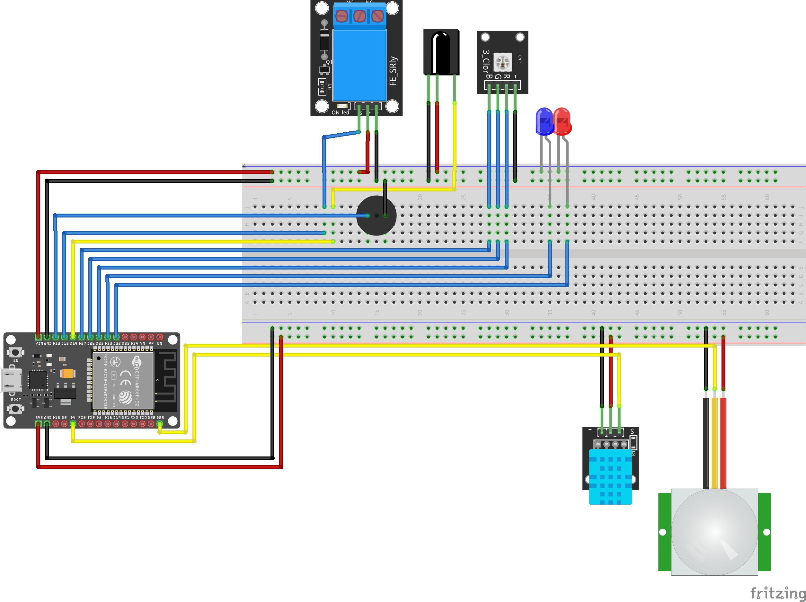

# 🏠 IoT Smart Home with ESP32

A **compact, practical smart home system** built using an **ESP32**, MQTT, and IR remote control, designed to showcase IoT skills for **portfolio and real-world use**.

---

## 🚀 Features

✅ **Temperature & Humidity Monitoring** (DHT11, MQTT reporting)  
✅ **PIR Motion Detection with Buzzer Alarm** (controllable via MQTT & IR Remote)  
✅ **MQTT-based LED On/Off Control**  
✅ **RGB LED PWM Control via MQTT**  
✅ **IR Remote Control for LEDs and Alarm**  
✅ **Local Mosquitto MQTT Broker Integration**  
✅ **Clean, extensible code structure for adding devices easily**

---

## 📦 Components Used

- **ESP32 Dev Board**
- **DHT11 Temperature & Humidity Sensor** (GPIO 4)
- **PIR Motion Sensor** (GPIO 23)
- **IR Receiver Module** (GPIO 14)
- **RGB LED with PWM** (GPIO 25 - Red, 26 - Green, 27 - Blue)
- **Buzzer for alarm** (GPIO 13)
- **Individual LEDs** (GPIO 12, 13, 32, 33)
- **Local Mosquitto MQTT Server**

---

## 🛠️ Wiring Diagram

> 📌 Replace this with your Fritzing diagram.



---

## ⚙️ Setup Instructions

1️⃣ **Clone this repository**:
```bash
git clone https://github.com/yourusername/ESP32-IoT-SmartHome.git

2️⃣ Install Dependencies:

    Arduino IDE or PlatformIO

    Install libraries:

        PubSubClient

        DHT

        IRremoteESP8266

3️⃣ Configure WiFi and MQTT in main.ino:

const char* ssid = "YOUR_WIFI_SSID";
const char* password = "YOUR_WIFI_PASSWORD";

const char* mqtt_server = "YOUR_MQTT_BROKER_IP";
uint16_t mqtt_port = 1883;

4️⃣ Flash the code to your ESP32.

5️⃣ Run Mosquitto locally:

mosquitto -v

Or install using:

    Windows: Mosquitto Installer

    Linux: sudo apt install mosquitto mosquitto-clients

🛰️ MQTT Topics
Topic	Description	Payload Examples
onnoff	Control LEDs	1_1 (on), 1_0 (off)
alarm_on	Enable/disable alarm system	1 (on), 0 (off)
red	Red PWM brightness (0-255)	128
green	Green PWM brightness (0-255)	200
blue	Blue PWM brightness (0-255)	255
temp	Temperature readings from ESP32	24.50
hum	Humidity readings from ESP32	55.00
alarm	Motion detection status	high, low
🖥️ IR Remote Control Mappings

Use an IR remote to control:

    Turn LEDs on/off

    Enable/disable alarm

    Control additional functions directly without MQTT

🖼️ Project Images

    📌 Replace with real images of your setup.

✅ Future Improvements

    Add OTA updates for remote firmware upgrades

    Use JSON payloads in MQTT for structured data

    Add web interface for manual control

    Integrate Node-RED dashboard for visualization

    Power optimization for real deployments

📄 License

This project is licensed under the MIT License.
🤝 Contributing

Pull requests are welcome! For significant changes, please open an issue first to discuss what you would like to change.
✨ Acknowledgments

    ESP32 Community

    Mosquitto MQTT

    Arduino

    Open-source libraries enabling IoT learning.

🔗 Contact

[Your Name]
GitHub: yourusername
Email: [youremail@example.com]
