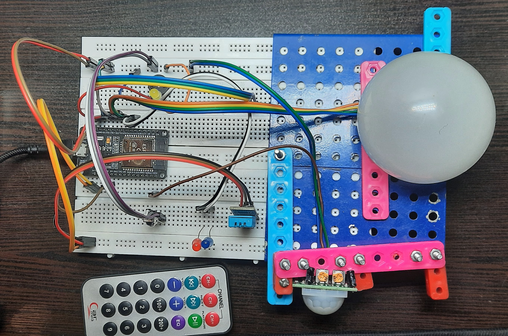
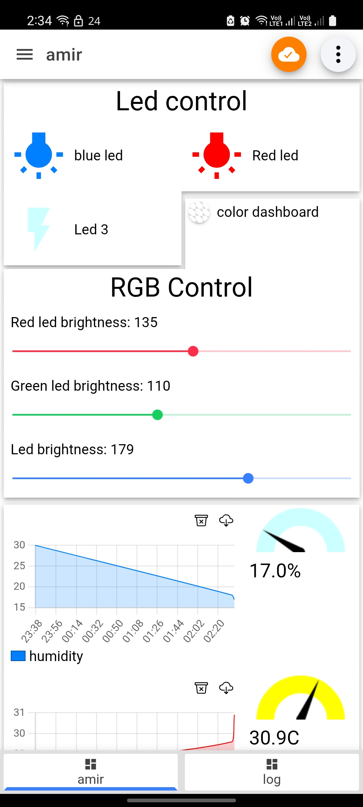
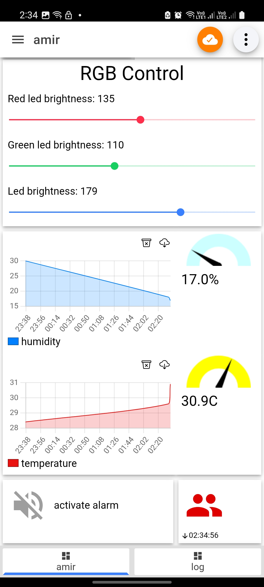

# 🏠 IoT Smart Home with ESP32

A **compact, practical smart home system** built using an **ESP32**, MQTT, and IR remote control, designed to showcase IoT skills for **portfolio and real-world use**.

---

## 🚀 Features

✅ **Temperature & Humidity Monitoring** (DHT11, MQTT reporting)  
✅ **PIR Motion Detection with Buzzer Alarm** (controllable via MQTT & IR Remote)  
✅ **MQTT-based LED On/Off Control**  
✅ **RGB LED PWM Control via MQTT**  
✅ **IR Remote Control for LEDs and Alarm**  
✅ **Local Mosquitto MQTT Broker Integration**  
✅ **Clean, extensible code structure for adding devices easily**

---

## 📦 Components Used

- **ESP32 Dev Board**
- **DHT11 Temperature & Humidity Sensor** (GPIO 4)
- **PIR Motion Sensor** (GPIO 23)
- **IR Receiver Module** (GPIO 14)
- **RGB LED with PWM** (GPIO 25 - Red, 26 - Green, 27 - Blue)
- **Buzzer for alarm** (GPIO 13)
- **Individual LEDs** (GPIO 12, 32, 33)
- **Local Mosquitto MQTT Server**

---

## 🛠️ Wiring Diagram

   


| Component                       | ESP32 Pin      | Notes               |
|---------------------------------|----------------|----------------------|
| **DHT11 (Temperature & Humidity)** | GPIO 4         | Digital data pin     |
| **PIR Motion Sensor**           | GPIO 23        | Digital OUT          |
| **IR Receiver**                 | GPIO 14        | Digital OUT          |
| **Buzzer (Alarm)**              | GPIO 13        | Uses `tone()` function |
| **LED 1**                       | GPIO 12        | General output LED   |
| **LED 2**                       | GPIO 13        | (Shares with Buzzer) |
| **LED 3**                       | GPIO 32        | General output LED   |
| **LED 4**                       | GPIO 33        | General output LED   |
| **RGB LED - Red**               | GPIO 25 (PWM)  | Controlled via MQTT  |
| **RGB LED - Green**             | GPIO 26 (PWM)  | Controlled via MQTT  |
| **RGB LED - Blue**              | GPIO 27 (PWM)  | Controlled via MQTT  |


---

## ⚙️ Setup Instructions

1️⃣ **Clone this repository**:
```bash
git clone https://github.com/already-amir/ESP32_IOT.git
```
2️⃣ Install Dependencies:

    Arduino IDE or PlatformIO

    Install libraries:

        PubSubClient

        DHT (DHT kxn by Adafruit)

        IRremote

3️⃣ Configure WiFi and MQTT in main.ino:
```cpp
const char* ssid = "YOUR_WIFI_SSID";
const char* password = "YOUR_WIFI_PASSWORD";

const char* mqtt_server = "YOUR_MQTT_BROKER_IP";
uint16_t mqtt_port = 1883;
```
4️⃣ Flash the code to your ESP32.

5️⃣ Run Mosquitto locally:
```bash
mosquitto -v
```
Or install using:

    Windows: Mosquitto Installer

    Linux: sudo apt install mosquitto mosquitto-clients

## 🛰️ MQTT Topics

| Topic      | Description                  | Payload Examples        |
|------------|------------------------------|-------------------------|
| `onnoff`   | Control LEDs                 | `1_1` (on), `1_0` (off) |
| `alarm_on` | Enable/disable alarm system  | `1` (on), `0` (off)     |
| `red`      | Red PWM brightness (0-255)  | `128`                   |
| `green`    | Green PWM brightness (0-255)| `200`                   |
| `blue`     | Blue PWM brightness (0-255) | `255`                   |
| `temp`     | Temperature from ESP32       | `24.50`                 |
| `hum`      | Humidity from ESP32          | `55.00`                 |
| `alarm`    | Motion detection status      | `high`, `low`           |

## 📱 Mobile App Control

You can **control and monitor your ESP32 IoT Smart Home system directly from your smartphone** using a free MQTT client app.

### ✅ Recommended App

We recommend using:

- **MQTT Dashboard (Android)**  
  [Download from Google Play](https://play.google.com/store/apps/details?id=at.tripwire.mqtt.client)

---

### ⚙️ Configuration File

To simplify setup, you can **import the provided configuration file into the app to auto-generate dashboards for controlling LEDs, RGB, and monitoring temperature, humidity, and alarm status**.

**Download Configuration File:**

[📥 MQTT Dashboard Config File](docs/IoTMQTTPanel.json)

> ⚠️ After importing the configuration:
> - Replace the **MQTT broker IP address** with your local server IP (e.g., `192.168.0.xx`).
> - Ensure your phone is connected to the **same WiFi network as your ESP32**.


🖼️ Project Images

<p align="center">
  
</p>

<p align="center">
  
  
</p>


✅ Future Improvements

    Add OTA updates for remote firmware upgrades

    Use JSON payloads in MQTT for structured data

    Add web interface for manual control

    Integrate Node-RED dashboard for visualization

    Power optimization for real deployments

📄 License

This project is licensed under the MIT License.

### 🤝 Contributing

Pull requests are welcome! For significant changes, please open an issue first to discuss what you would like to change.
✨ Acknowledgments

    ESP32 Community

    Mosquitto MQTT

    Arduino

    Open-source libraries enabling IoT learning.

🔗 Contact

[Amir]
GitHub: yourusername
Email: [already.amirm@gmail.com]
